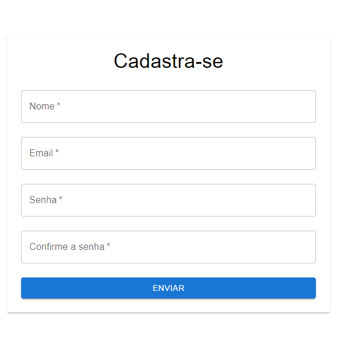
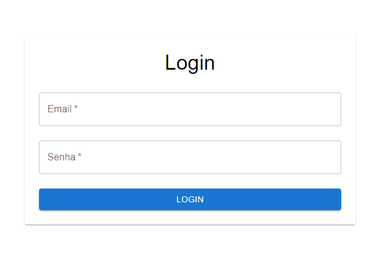
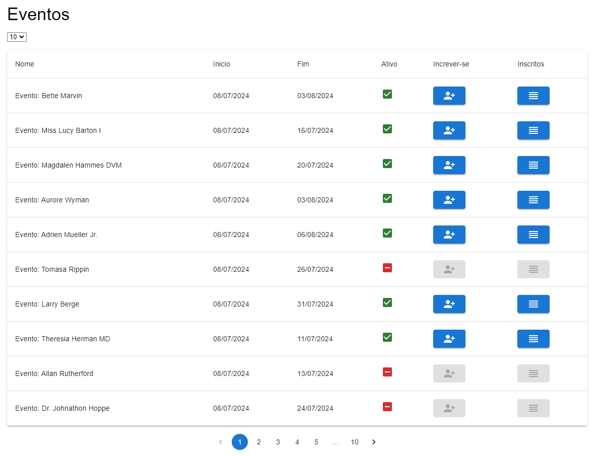
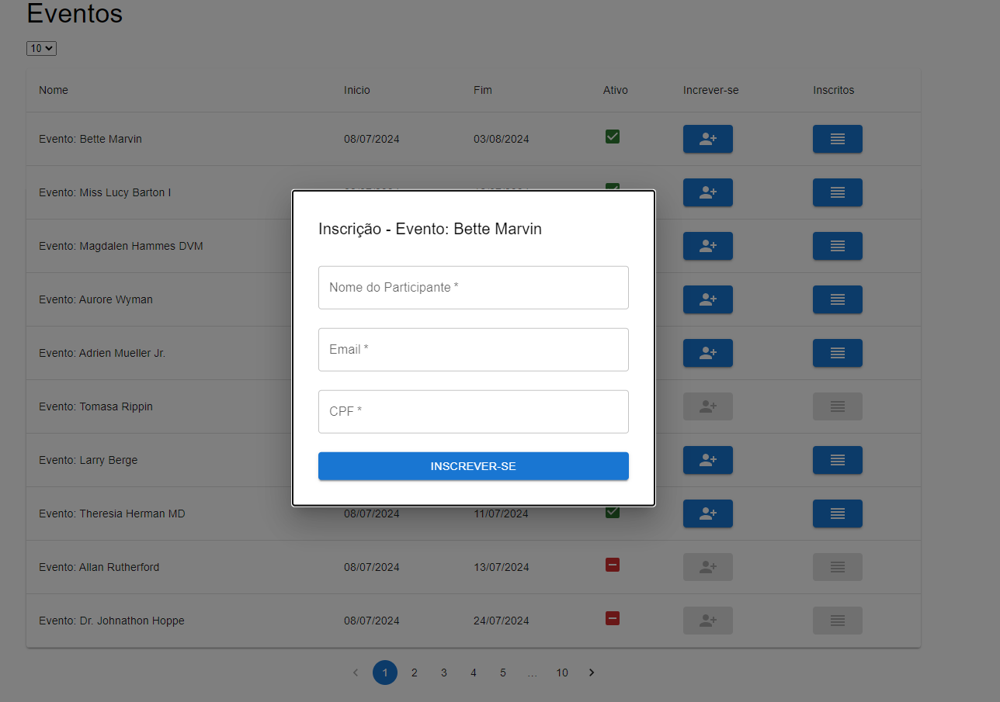
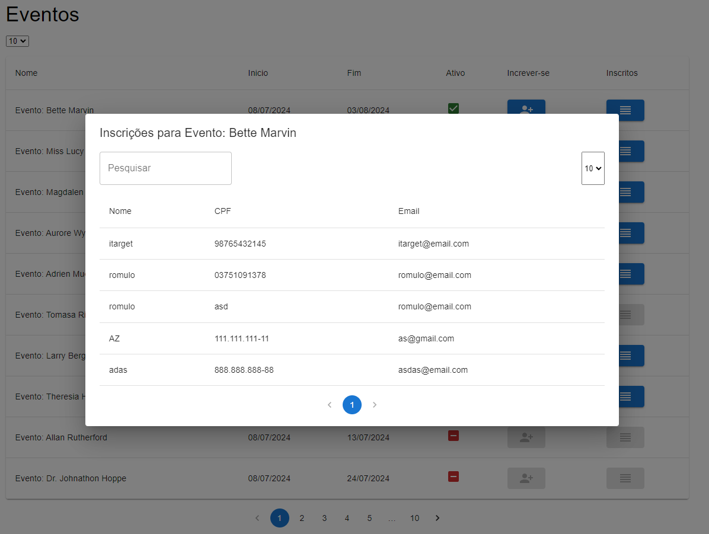

# Itarget Case

Clone o projeto: ``git clone git@github.com:romulo2735/itarget_case.git``

Usando o docker crie o ambiente: ``docker-compose up -d``

Backend: ``http://127.0.0.1:8989``

Frontend: ``http://localhost:3000``

### Backend Endpoints 

````
  GET|HEAD        / ......................................................................................................................... generated::WYq8GN6QAKBVL1oe
  GET|HEAD        api/events ....................................................................................................... events.index › EventController@index
  POST            api/events ....................................................................................................... events.store › EventController@store
  GET|HEAD        api/events/create .............................................................................................. events.create › EventController@create
  GET|HEAD        api/events/{event} ................................................................................................. events.show › EventController@show
  PUT|PATCH       api/events/{event} ............................................................................................. events.update › EventController@update
  DELETE          api/events/{event} ........................................................................................... events.destroy › EventController@destroy
  GET|HEAD        api/events/{event}/edit ............................................................................................ events.edit › EventController@edit
  GET|HEAD        api/events/{event}/registrations ........................................ generated::KdnhwkJOhAetr0Dw › RegistrationController@getRegistrationsForEvent
  POST            api/login .......................................................................................... generated::i7ByCTutNBGH3jbI › UserController@login
  POST            api/register .................................................................................... generated::VUCoBqzGIfjwzDW2 › UserController@register
  GET|HEAD        api/registrations .................................................................................. registrations.index › RegistrationController@index
  POST            api/registrations .................................................................................. registrations.store › RegistrationController@store
  GET|HEAD        api/registrations/create ......................................................................... registrations.create › RegistrationController@create
  GET|HEAD        api/registrations/{registration} ..................................................................... registrations.show › RegistrationController@show
  PUT|PATCH       api/registrations/{registration} ................................................................. registrations.update › RegistrationController@update
  DELETE          api/registrations/{registration} ............................................................... registrations.destroy › RegistrationController@destroy
  GET|HEAD        api/registrations/{registration}/edit ................................................................ registrations.edit › RegistrationController@edit
  PUT             api/user/update ................................................................................... generated::2aVjLT4SUXlxS1wj › UserController@update
````


### Páginas

`register`
)

`login`
)

`events`
)
)
)
